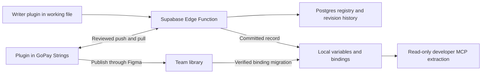

# String Binder: authoring, Supabase registry, and bidirectional library sync

## 1. Summary and chosen architecture

Build three connected workflows:

1. **Writers:** apply existing copy or create/edit bilingual copy from Figma frames.
2. **Library maintainer:** push variable edits to Supabase, pull saved changes into GoPay Strings, and publish.
3. **Developers:** read frame-specific IDs, keys, and EN/ID values through the official Figma MCP.

**Supabase is the authoritative saved registry.** Working files and the central library are editable delivery surfaces carrying identified revisions.

Chosen defaults:

- Supabase Free for the pilot, in Singapore; no Apps Script, Google OAuth, or required Google Sheet integration.
- No writer login. Embed a limited team token that the Edge Function validates.
- Supabase database credentials remain server-side. Publisher operations require a separate token, entered once by the maintainer.
- Writers review and submit their own copy without a second approval gate.
- New copy binds locally immediately; central publication happens later.
- Working files refresh automatically while their plugin is open. Central library changes require explicit Pull/Push.
- Both EN and ID are required for creation and wording edits.
- Exact duplicates are suggestions; writers choose reuse or distinct identity.
- Existing Copy IDs, developer keys, aliases, and migration history are preserved.

The embedded team token is extractable. It authorizes whoever possesses it and does not establish a verified writer identity. Record device/session identifiers and optional names as unverified attribution. Keep direct database access blocked and publisher privileges separate. [Supabase key guidance](https://supabase.com/docs/guides/getting-started/api-keys)

## 2. User journeys and recovery cases

### A. Open the plugin

**Open → choose Apply existing copies or Create new copies.**

Show these two primary actions immediately. Load cached catalog data, connect in the background, and display connection/synchronization status.

A secondary **Library sync** action opens the maintainer workflow after one-time publisher setup. It is not a third primary writer choice.

Changing mode preserves drafts.

### B. Apply existing copy

**Select frame → Apply existing copies → choose product → search/review matches → Apply.**

Keep the current search and matching experience:

- Search within the chosen product plus Shared.
- Review candidate values, context, and bindings.
- Keep existing skip, include, and unbind capabilities.
- Preview matching duplicate targets on the current page.
- Apply selected bindings and rename managed layers to their developer keys.

A saved record is selectable even before library publication. If its latest revision is not available through a verified published variable, materialize it locally and bind that instead.

**Result:** selected layers use the chosen identity, language, and revision.

### C. Create copy written into a frame

**Write in Figma → select frame → Create new copies → select rows → enter translations → Review → Save and apply.**

The plugin lists visible text in reading order.

Each row shows:

- Canvas text and original layer name.
- Context and any existing binding.
- Whether it appears to be copy or a data-only/non-copy value.
- Its selected action.

Rows default to **Keep as is**. Provide a shortcut to select eligible unbound rows, while preserving individual control.

Set a frame-level canvas language, EN or ID, with per-row overrides. Populate that language field from the canvas and leave the other empty. Both fields remain editable in the plugin.

Require a product. Infer feature, screen, context, role, and qualifier where reliable; let writers correct them. Show the proposed key without requiring writers to type IDs.

Review shows translations, provisional keys, collections, affected duplicate targets, and conflicts.

On **Save and apply**:

1. Preflight the canvas and fonts.
2. Save the reviewed batch to Supabase.
3. Receive final identities, keys, and revisions.
4. Create/reuse local variables with EN/ID values.
5. Bind reviewed occurrences and rename their layers.
6. Show completion and any outstanding Figma work.

**Result:** bilingual copy is saved and usable immediately. The writer can select the next frame.

### D. Skip strings

**Leave a row as Keep as is, or deselect it before submission.**

That row receives no creation, rebinding, renaming, or language-mode change from the submission.

Hidden text is excluded. Suspected non-copy appears with its reason and can be explicitly included.

Keeping a row does not freeze a shared identity: if it already uses an identity that receives an intentional global edit, its value follows that identity.

### E. Reuse a duplicate

**Enter both languages → inspect duplicate suggestion → choose Reuse existing or Create distinct copy.**

Show the existing record’s product, context, key, and bilingual values.

- **Reuse:** keep its Copy ID and key; bind the selected occurrences.
- **Create distinct:** allocate a different Copy ID and unique key, even if wording matches.

Do not automatically merge concurrent identical creations. Earlier migration consolidation rules do not apply to new authoring.

### F. Edit existing copy globally

**Select a bound row → Edit existing → change EN/ID → review impact → Save and apply.**

Keep its Copy ID and developer key.

Explain that this edit changes the identity for all usages. Show known current-file usage counts without claiming a complete cross-file inventory.

After saving:

- Update managed local variables in place.
- Where necessary, switch known published bindings in the current file to the newer local revision.
- Other active plugins refresh on their next poll.
- The central library shows a remote change awaiting Pull.
- Closed files catch up later.

If another writer changed the record since review, show a revision conflict instead of overwriting it.

### G. Create a screen-specific variant

**Select existing copy → Create variant → supply bilingual wording/context → Save and apply.**

Allocate a new Copy ID and key, with `forkedFrom` referencing the original.

Bind the selected frame and reviewed duplicate targets to the variant. Other occurrences of the original identity retain their wording.

Duplicating a frame alone does not fork its copy identities.

### H. Push edits made directly in GoPay Strings

**Edit variable values in Figma → Library sync → Check changes → Push → review → Confirm.**

Compare actual EN/ID values and editable context with the last synchronized record and current Supabase record.

Show local-only changes, conflicts, and invalid entries separately.

Push uses the same bilingual validation, revision checks, and transaction rules as writer submissions. After successful saving, update synchronization metadata on the existing variables.

**Result:** existing Copy IDs, developer keys, and Figma variable keys remain intact; Supabase gains new revisions.

Unpushed manual edits are clearly marked and are not treated as committed developer handoff records.

### I. Push a variable created directly in the library

**Create a string variable in a product collection → fill EN/ID → Check changes → review as a new record → Push.**

For a genuinely new variable without identity:

- Confirm its product and context.
- Validate both modes.
- Offer bilingual duplicate suggestions.
- Allocate a Copy ID and final unique key.
- Attach the committed identity to the existing Figma variable and rename it if necessary.

Do not create a second Figma variable for the same submission.

If reuse is chosen, consolidate its usages onto the existing canonical variable; remove the temporary variable only after verified rebinding and zero remaining references.

An unidentified legacy variable must be resolved against the existing registry; never mint another identity for it. New entries in `# Legacy` collections are blocked with instructions to use a product collection.

### J. Pull changes into GoPay Strings

**Library sync → Check changes → Pull → review remote changes → Confirm.**

Pull creates missing variables and updates existing variables in place.

- Resolve modes by name.
- Keep existing Figma variable keys where the variable still exists.
- Place new records in the configured product collection.
- Protect unpushed local edits.
- Apply a fixed revision manifest so changes arriving during Pull remain pending for the next pass.

**Result:** the library draft matches the pulled revisions and shows **Needs publish**.

### K. Resolve a library conflict

Compare three versions:

- **Base:** last synchronized revision.
- **Figma:** current library values.
- **Supabase:** current saved revision.

Offer:

- **Use Supabase:** explicitly replace the local change.
- **Use Figma:** review it as an edit against the current Supabase revision.
- **Combine:** edit both languages and save against the current revision.
- **Defer:** leave the record untouched.

Recheck the revision when confirming. If Supabase changes again, reopen the conflict.

### L. Publish and migrate working-file bindings

**Complete Pull/Push → publish through Figma → Verify publication in plugin.**

The plugin verifies the exact synchronized manifest before marking revisions published.

Working-file plugins migrate local bindings to imported published variables only when the published revision and actual bilingual values match the needed record.

Never replace a newer local revision with older published wording. Preserve local variables until no remaining bindings use them.

### M. Developer handoff

**Developer supplies frame links to their MCP client → run the documented read-only extractor → receive JSON bundle.**

The bundle includes:

- Frame and text occurrence identifiers.
- Copy ID, developer key, applied revision, and displayed language.
- Exact EN and ID values for each managed identity.
- Unmanaged text and actionable consistency issues.

Publication is not required for saved local copy.

The extractor reads the revision represented in Figma. It does not substitute newer backend wording or infer translations.

If selected frames contain conflicting revisions of one identity, it reports the conflict instead of silently choosing one.

### Other cases

| Case | User-visible behavior and recovery |
|---|---|
| Missing translation or invalid placeholders | Highlight the row; complete it or change it to Keep before submitting. |
| Switch frames or reopen plugin | Restore translations and decisions after checking the current canvas baseline. |
| Canvas changes during saving | Keep the committed record; mark the changed occurrence unapplied and offer reconciliation. |
| Save succeeds but binding fails | Show **Saved, not fully applied**; retry only the Figma operation using the saved record. |
| Save response times out | Check request status; retry with the same request ID and proposed identities. |
| Two writers create the same proposed key | Allocate different final keys transactionally; show the final keys after saving. |
| Two writers edit the same revision | First valid commit succeeds; the other receives a conflict with the latest record. |
| Backend unavailable | Preserve drafts; disable saves. Existing available Figma variables can still be applied with an offline status. |
| Token revoked or configuration invalid | Show connection failure and preserve local work; do not fall back to public database writes. |
| Manual variable edit in a working file | Detect the discrepancy; offer push as a reviewed edit, restore saved values, or create a variant. |
| Variable renamed manually | Preserve identity; restore its frozen key on reconciliation. Rekeying is outside v1. |
| Variable deleted from the library | Do not delete its registry record. Offer Pull to recreate it and record the changed Figma mapping. |
| Same identity appears in duplicate local variables | Reconcile delivery mirrors; do not assign another identity automatically. |
| Undo in Figma | Undo canvas changes only. Saved registry records and reserved keys remain. |

## 3. Frontend and integration changes

### UI structure

Keep the existing Apply workflow and add a separate authoring draft model.

Use a 640 × 760 authoring/sync window with a scrolling body and persistent bottom action bar; retain the existing compact Apply layout.

Authoring proceeds through **Select → Edit → Review → Results**.

Row actions are:

- Keep as is.
- Create new.
- Reuse existing.
- Edit existing.
- Create variant.

Display both languages together. Preserve exact whitespace and line breaks; use trimming only to detect blank values, not to rewrite stored copy.

Product selection uses one configurable list. Context fields are editable; identity and frozen keys are system-managed. Proposed keys are labeled provisional because concurrent submissions can allocate a suffix.

Persist drafts and incomplete operations in private local storage. Keep canvas fingerprints, baseline records, translations, selected actions, context, proposed Copy IDs, and request IDs.

### Status model

Avoid a single ambiguous “Synced” badge.

Working-file statuses:

- Draft.
- Saved, not applied.
- Bound locally.
- Using published library.
- Update pending.
- Conflict.

Library statuses:

- Up to date.
- Local changes.
- Remote changes.
- Conflict.
- Needs publish.

Results distinguish successful registry saves from successful Figma operations, with per-record retry actions.

### Controller and contracts

Extend the typed UI/controller bridge for:

- Draft scanning and baseline refresh.
- Reviewed batch submission and request-status lookup.
- Materialization/binding progress and recovery.
- Working-file synchronization.
- Library diff, Push, Pull, conflict resolution, and publication verification.

Correlate asynchronous responses with operation IDs so results from a previous frame cannot overwrite the current draft.

Perform network requests through the native controller’s supported fetch API. Schedule polling and debounce in the UI; retain the controller’s existing restrictions on browser globals and timers.

Replace the manifest’s network denial with the specific Supabase project domain. Permit localhost only in development. Update the sandbox check to validate this allowlist.

Reuse the existing selection, font-loading, language resolution, ranking, binding, and duplicate-matching primitives. Do not build a second binding engine.

### Scope of propagation

New bindings and variants affect the selected frame plus reviewed matching duplicates on the current page.

Identity edits and refreshes can affect all known usages in the current file. Load pages as needed for binding migration and report inaccessible occurrences. Never detach instances automatically.

Set language modes on affected occurrences where needed, rather than changing parent modes that could alter skipped text.

## 4. Supabase, revision rules, and Figma synchronization

### Access and deployment

Use one Edge Function router and Postgres database functions.

- The writer build contains a random, limited team token supplied through build configuration.
- Validate its hash server-side before reading registry data or performing operations.
- Publisher token setup is separate and stored privately on the maintainer’s device.
- Do not store credentials in Figma metadata or logs.
- Support token rotation and overlapping old/new tokens during a planned upgrade.
- Block anonymous and direct client access to registry tables and mutation functions.
- Rate-limit by credential, with database-enforced counters and retryable responses.
- Configure the function for custom token authentication; disabling the user-JWT check must not disable the handler’s token validation. [Edge Function authentication](https://supabase.com/docs/guides/functions/auth)

There is no Supabase Auth account requirement in v1. Token roles define access; supplied writer names, device IDs, file URLs, and Figma metadata do not grant privileges.

### Data and minimum API

| Storage | Responsibility |
|---|---|
| `copies` | Current identity, frozen key, values, context, lifecycle status, and revision. |
| `key_reservations` | Globally unique current keys, aliases, and tombstones. |
| `copy_revisions` | Immutable bilingual/context records for each identity and revision. |
| `requests` | Request ID, canonical payload hash, and committed response. |
| `changes` / `registry_head` | Ordered catalog and delivery changes. |
| `products` | Display names, frozen key tokens, and legacy mappings. |
| `libraries`, `library_mappings`, `sync_runs` | Central-library registration, manifests, leases, and delivery acknowledgements. |

Shared interface additions:

- `CopyRecord`: identity, platform key, revision, EN/ID values, product, context, role, status, and optional fork origin.
- `AuthoringDraft`: row actions, edited values, and canvas/registry baselines.
- `MutationBatch`: persistent request ID and reviewed operations.
- `MutationResult`: committed records or structured conflicts.
- `BindingResult`: successes, conflicts, failures, and outstanding work.
- `LibraryDiff`: base/local/remote records and classification.
- `SyncManifest`: fixed identity/revision/value fingerprints.
- `FrameBundle`: managed occurrences, bilingual records, unmanaged text, and issues.

Expose these operations through the Edge Function:

| Operation | Purpose |
|---|---|
| Catalog snapshot and changes | Initial search data and sequence-based refresh. |
| Copy batch submission | Create, edit, variant, and explicit reuse. |
| Request lookup | Recover an uncertain save result. |
| Revision lookup | Retrieve an immutable historical baseline when needed. |
| Library sync start/acknowledge | Coordinate a fixed manifest and record applied mappings. |
| Publication acknowledge | Record only verified published revisions. |

Use standard HTTP results, including validation errors, revision conflicts, unauthorized access, throttling, and retryable service failures.

### Transaction and identity rules

Run every reviewed batch as one Postgres transaction:

1. Acquire the transaction lock on the registry sequence row.
2. Check idempotency, permissions, expected revisions, and validation.
3. Allocate final keys using permanent reservations.
4. Write current records, immutable revisions, change events, and request response.
5. Commit together.

All mutation paths, including library Push, use this function. No direct table editing is a second authoring path.

- Copy IDs use the existing UUIDv7/CSPRNG helper and remain persisted across retries.
- A create is create-only; an existing ID is not silently upserted.
- Keys are globally reserved, including historical aliases and deleted identities.
- Concurrent collisions allocate `_2`, `_3`, etc.
- Wording and context edits retain the identity and key.
- Expected-revision mismatches reject the reviewed batch without partial copy changes.
- Reusing a request ID with another payload is an error.
- Multiple edits to one identity within a batch must agree.
- An uncertain response is recovered through idempotent resubmission/status lookup; the Sheets-specific pending-journal mechanism is removed.

Align key normalization and shortening with the authoritative naming rules before rollout.

### Catalog refresh

Return a full snapshot from one consistent database snapshot, followed by ordered deltas.

Do not truncate the approximately 20,000-record catalog through a default database row limit.

Advance delta cursors only through returned events. Allocate sequences while holding the transaction lock through commit so concurrent commits cannot create missed changes.

Search remains local over the cached catalog. Poll every 30 seconds with jitter while open, and refresh before submission and after saving. Use backoff on failures. Realtime subscriptions are outside v1.

### Local variables and metadata

Materialize only records used in a working file.

Use configured product collection names, with explicit management markers. If an unrelated collection already uses that name, create `<Product> · String Binder` instead of adopting it.

Partition after 4,000 variables. New variables have EN/ID modes, flat developer-key names, and `TEXT_CONTENT` scope. Working-file delivery variables are excluded from publication.

Use the existing `copy` shared-data namespace:

- Variables retain `copy/id` and a versioned committed record.
- Occurrences carry identity references and compatible applied snapshots.
- Descriptions retain the Copy ID/context/note convention and add compact machine-readable revision/fingerprint metadata.

Fingerprint the canonical identity, key, revision, and bilingual pair. Validate metadata against actual values during synchronization and MCP extraction.

An incomplete metadata update is recoverable. It must not make an unverified frame appear ready.

### Bidirectional library algorithm

Each managed library variable retains its last synchronized record **B**. Compare it with local Figma record **L** and current Supabase record **R**:

| Comparison | Classification |
|---|---|
| L = B and R = B | Up to date. |
| L differs; R remains B | Local change eligible for Push. |
| L remains B; R differs | Remote change eligible for Pull. |
| L and R are identical | Adopt the current revision without another wording edit. |
| L and R both differ and disagree | Conflict requiring review. |

Comparison covers EN/ID and supported editable context. Identity/key discrepancies are separate errors.

With no trusted baseline, use explicit initial reconciliation; never guess that one side is newer.

Register GoPay Strings using its supplied URL and verified local variable mappings. Do not depend on `figma.fileKey` being available: that property requires private-plugin API access. File markers assist destination checks but are not authentication. [Figma file-key access](https://developers.figma.com/docs/plugins/api/figma/#filekey)

Use one designated publisher initially. A lease coordinates sync sessions, but cannot make Figma writes transactional. Recheck before each chunk, stop on lease loss, and rescan before retrying.

Push commits to Supabase before stamping Figma metadata. Pull writes Figma before acknowledging its applied manifest. Either direction can be partially complete and must resume from verified state.

Publishing remains a separate Figma action. Acknowledgements refer to exact manifests and never clear newer pending revisions.

### MCP handoff contract

Provide a versioned, read-only `use_figma` extraction script and developer instructions.

The script:

- Traverses requested frame occurrences.
- Resolves actual EN/ID modes and aliases.
- Reads verified identity/revision metadata.
- Returns one bilingual record per identity/revision.
- Reports unknown identities, unpushed wording, missing modes, fingerprint mismatches, and conflicting revisions.
- Uses bounded chunks and detects changes during a multi-call extraction.
- Never mutates Figma or fetches newer wording to replace the frame snapshot.

If a read changes mid-extraction, retry it rather than mixing revisions.

The official tool has a response-size limit, so large bundles must be assembled from complete chunks. [Figma MCP capabilities](https://developers.figma.com/docs/figma-mcp-server/write-to-canvas/)

## 5. Build sequence, acceptance tests, and rollout

### Build sequence

1. **Contracts and mock journeys:** home, authoring rows, bilingual editor, drafts, review, results, conflicts, and library diff using deterministic fixtures.
2. **Supabase foundation:** schema migrations, token-gated Edge Function, transaction functions, idempotency, catalog, and bootstrap tooling.
3. **Writer integration:** save-and-apply, local materialization, duplicate propagation, variants, and recovery.
4. **Working-file synchronization:** automatic refresh, manual-change protection, and file-wide identity updates.
5. **Library integration:** baseline reconciliation, Push/Pull, direct-library creation, publication manifests, and binding migration.
6. **MCP handoff and pilot:** validate extraction from both local delivery variables and imported library variables.

Keep local mock testing authentication-free. Remote environments always validate the configured token.

Bootstrap from the existing registry and verified Figma mappings. Preserve all identities, aliases, tombstones, and recorded redirects. Unresolved legacy ownership conflicts block bootstrap rather than being “fixed” through new IDs.

Replace the previous architecture documentation with this specification. Update copy rules where the accepted behavior differs: explicit duplicate choice, delivery mirrors retaining identity, Supabase transactions, no-login access, and frame-based MCP handoff.

### Required tests

**Writer and frontend**

- All main journeys above, including mixed-language frames.
- Blank translations, placeholder mismatch, Unicode, whitespace, and multiline text.
- Draft persistence across selection, mode changes, and reopen.
- Selection changes during asynchronous save.
- Keep rows unaffected by creation and parent-mode changes.
- Existing Apply/search behavior preserved.

**Registry and concurrency**

- Ten concurrent writers against a seeded 20,000-record catalog.
- Unique keys under concurrent same-stem creation.
- Distinct identities for explicitly distinct identical wording.
- Competing edits, conflicting reuse baselines, and atomic batch rejection.
- Repeated requests, altered payloads, and lost responses after commit.
- Complete snapshots and deltas during concurrent commits.
- Missing/revoked tokens, forged roles, and denied direct table/RPC access.

**Figma and library**

- Save success followed by font/binding/metadata failure.
- Simultaneous same-file materialization and duplicate reconciliation.
- Manual working-variable changes protected from automatic refresh.
- Every B/L/R classification, including missing baseline.
- Library Push followed by another local edit before acknowledgement.
- Publisher interruption, takeover, and retry without duplicate variables.
- New edits arriving during Pull or publication.
- Deleted variables, changed mappings, frozen keys, and locale preservation.
- Older published copy never replacing a newer local revision.

**Developer handoff**

- Exact identity/key/revision/EN/ID from real working frames.
- Local and imported variables, alias modes, instances, and repeated usages.
- Unpushed library edits and stale metadata reported.
- Large extraction completeness and mid-read changes.
- Cross-frame/file revision conflicts detected.

Run meaningful unit/integration tests plus production build, type checking, linting, and the updated sandbox check under Node 22. The existing focused baseline already passes 13 tests; new behavior requires the additional coverage above.

### Pilot and operational defaults

Start on Supabase Free, measure storage including revision history, transfer volume, function invocations, and save latency. Provide daily external database dumps and verify restoration during the pilot.

Free projects can pause after inactivity and do not include automatic backups. Upgrade the same project to Pro when daily team use requires those operational protections; Pro currently starts at $25/month. [Supabase pricing](https://supabase.com/pricing)

Log request IDs, operation outcomes, conflict counts, binding failures, sync lag, and publication status without credentials. Preserve cached data and drafts during backend interruptions.

Pilot acceptance requires a writer-created string, a competing edit, a direct-library Push, a Supabase Pull, a verified publication, and a complete developer MCP bundle to pass end to end.

Branches/releases, automatic publication, unattended updates to closed Figma files, admin rekeying, and destructive registry deletion are outside v1.
