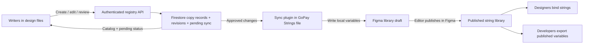

# String Binder: concurrent authoring and library delivery

Decision prepared on 2026-10-02. The team's Figma plan is not Enterprise. This is the implementation plan for the later create/edit feature; this change implements search and prepares migration artifacts, without deploying an authoring service.

## Recommended source of truth

Use the hosted registry as the authoritative copy store. Figma's GoPay Strings file is its published delivery surface. All plugin clients write through one authenticated backend; they do not compete to edit library variables directly.

Reuse the repository's earlier Cloud Run, Google Workspace authentication and Firestore stack (on `main`), rather than adding another database or a search service. The Binder branch currently has no backend. Restore only the authentication/session pieces needed for the registry; Sheets is no longer an editing dependency. Keep search local over a versioned catalog using the ranking implemented here.

The unavoidable boundary: Figma's Variables REST API requires Enterprise membership and appropriate seats/permissions. Even on Enterprise, writing variables does not publish them. With this team's plan, a plugin must run **inside the library file**, write its local variables, and an editor must publish the library in Figma. A server alone cannot provide unattended cross-file write-and-publish on this plan. See [Figma Variables API requirements](https://developers.figma.com/docs/rest-api/variables/) and [variable endpoints](https://developers.figma.com/docs/rest-api/variables-endpoints/). The documented API has local/published reads and local writes; the Plugin API exposes publishing status, not a publishing operation: [Variable API](https://developers.figma.com/docs/plugins/api/Variable/).

“Save” and “Available in library” are separate states. The sync plugin can stay open during a writing session to reduce delay, but it cannot work while the library file/plugin is closed. If fully unattended immediate publication is mandatory, Figma cannot be the sole delivery channel under the current plan; developers would also need a registry release endpoint. An Enterprise upgrade removes the open-library requirement for _writing_, while publishing still needs its own supported workflow.

## Records and concurrency

| Firestore document                        | Purpose                                                                                                                       |
| ----------------------------------------- | ----------------------------------------------------------------------------------------------------------------------------- |
| `copies/{cp_id}`                          | Immutable ID, frozen platform key, locales, shared flag, usages, status, revision, timestamps/actors, redirects and tombstone |
| `keys/{encoded_key}`                      | Permanent reservation of every current key and historical alias, pointing to a Copy ID; never delete reservations             |
| `requests/{actor_request_id}`             | Idempotency key, payload hash and saved response for safe retries; reject reuse with a different payload                      |
| `exactValues/{hash}`                      | Index over sorted locale names and **raw full values**; verify actual values before reuse, not hash alone                     |
| `changes/{cp_id_revision}`                | Immutable audit revision and delivery work item, created in the same transaction as the copy edit                             |
| `libraries/{library_id}`                  | Allowed Figma file, publisher lease and delivery checkpoint                                                                   |
| `libraries/{library_id}/mappings/{cp_id}` | Figma collection/variable ID and key, synced revision, published revision and previous mappings                               |

Use Firestore server transactions for create/edit, key reservations, exact reuse and the audit/work item. Firestore retries transactions when another client changes a read document and commits their writes together: [transaction documentation](https://firebase.google.com/docs/firestore/manage-data/transactions).

Create uses a client-generated CSPRNG UUIDv7 Copy ID and a persistent request ID. IDs avoid collisions, but do **not** prevent lost edits or duplicate copy; the transaction does that. For two simultaneous identical creates, the `exactValues` reservation makes the second reuse the committed entity and add its usage. For two simultaneous key collisions, reserve the next available `_2`, `_3` inside the retrying transaction, honoring tombstones and aliases. Never invent a random replacement key after a failed save.

Edit sends `expectedRevision`. In the transaction, compare it to the current revision; a mismatch returns `409` with both versions for review. Never silently overwrite the other writer. Increase the entity revision and write its immutable change record together. Client retries reuse the same request ID. Enforce writer/reviewer/publisher roles and Workspace membership on the server; keep credentials out of plugin messages and the UI.

Exact reuse compares **every available locale**, including placeholder names, case, punctuation, whitespace and line breaks. Missing translations remain draft and cannot accidentally merge with an approved bilingual string. Numeric/data-only values and whole placeholders remain contextual. A shared-copy edit affects all usages: show that impact, require review, and offer “Create a variant” to fork an ID for a product-specific change. Shared identity does not mean translations are interchangeable.

## Deterministic creation rules

The runnable helpers live in `packages/domain/src/copy-identity.ts`, exported from `@string-binder/domain`. `createCopyId(timestamp, entropy)` uses the migration's UUIDv7/Crockford format. The caller must obtain ten CSPRNG bytes using Web Crypto in the UI or `node:crypto` on the server. `isCopyId` checks the encoding, UUID version and variant. Do not use `Math.random`, text hashes, timestamps alone, counters or Figma node IDs as identity.

“Deterministic” means one creation operation always retains the same identity and one normalized context proposes the same developer key. It does not mean independently creating the same wording generates the same ID. Exact-copy reuse belongs in the transactional registry, preserving the existing canonical ID.

1. Generate and persist the proposed Copy ID and request ID once before sending. Keep them across network retries and UI restarts. Same actor/request ID + same canonical payload returns the saved response. Reusing a request ID for different content returns `409`.
2. Normalize product, feature, screen and context with `copyKeyStem`; role and optional primary/secondary/tertiary qualifier are explicit. Example: Split bill / Pay & split / Confirm / CTA primary → `gopay_splitbill_payandsplit_confirm_cta_primary`. Key normalization excludes locale and wording. Reject unsupported roles or an overlong key for correction.
3. In a server transaction, read the request, exact-value reservation, proposed ID and candidate key reservations **before any writes**. An exact approved match returns its canonical ID. An existing proposed ID owned by a different creation operation returns `409`; never update that document, treat it as reuse, or silently regenerate identity.
4. `nextCopyKey` proposes the bare key, then the smallest available ordinal from `_2`. Supply all current keys, aliases and tombstones read inside the transaction. Use create-only writes for new copy, permanent key reservation and request response; include usages, exact-value reservation and audit work item in the same commit. A transaction retry must reread reservations and recompute the key. A client-side free-key check alone provides no concurrency guarantee.
5. Return the committed canonical ID/key to the plugin. Freeze both on all later wording and context edits. A fork is a fresh operation with `forkedFrom`; deletion retains permanent reservations. Never let an edit endpoint accept changes to identity/key, and reject stale `expectedRevision`.

The helper test covers repeatable UUID encoding, invalid IDs, normalization, alias/tombstone reservations and ordinal collisions. The service must additionally test transaction races and restart/retry recovery when implemented; these helpers do not constitute a deployed concurrent allocator.

## API and writer flow

| Operation                               | Contract                                                                                                                                      |
| --------------------------------------- | --------------------------------------------------------------------------------------------------------------------------------------------- |
| `GET /catalog?stream=transfer`          | Only that stream and shared copies; include aliases, usages, record revisions, publication state and redirects                                |
| `POST /copies`                          | Request ID, proposed Copy ID, product/usage, inferred role and localized values; response is created or reused plus canonical ID/key/revision |
| `PATCH /copies/:id`                     | Request ID + expected revision + edited fields; immutable identity/key cannot be changed                                                      |
| `POST /copies/:id/approve`              | Reviewer checks translations, placeholders and shared impact; enqueues approved revision for library delivery                                 |
| `POST /libraries/:id/lease`             | Publisher-only, short renewable lease; one sync session for this library                                                                      |
| `GET /libraries/:id/pending`            | Approved revisions and mappings, plus unresolved failures                                                                                     |
| `POST /libraries/:id/ack`               | Lease token + exact applied revisions + returned Figma IDs/keys; mark synced, never automatically published                                   |
| `POST /libraries/:id/confirm-published` | Publisher confirms the specific revision manifest after publishing and verifying status; mark released revisions                              |

Select a frame → infer product, role and context → show existing matches → select unbound text to create → confirm copies and translations → save. The plugin handles IDs and keys. A missing locale is shown as a translation task, not filled with the other language. A new string gets “Saved · waiting for library sync”, then “Synced · waiting for publish”, then “Available in library”. Binding to the actual team variable is enabled only after it has a published key. Until then, leave the written frame text and record its pending Copy ID; do not pretend a local placeholder is the team-library variable.

The catalog should deliver a complete initial snapshot and immutable revision changes with a stable cursor. Apply updates by Copy ID and revision, including redirects/tombstones; capture a change cursor **before** building the snapshot, then replay changes so concurrent updates are not lost. Overlap pages and deduplicate change IDs when equal timestamps cross page boundaries. Publish a fresh catalog after delivery so the current per-user cache does not keep old copy indefinitely.

## Library sync

1. Verify the exact allowed library file and a publisher lease. In the library, match variables using `copy/id` plugin data, then description line 1. Backfill legacy IDs from the registry. Ambiguous/missing identity is a failure to review, not permission to mint a replacement.
2. Resolve `EN` and `ID` by name. Create missing approved entities in product collections or Shared; keep a 4,000-variable operational limit and split numbered partitions. Figma currently documents a 5,000-variable API limit, so 4,000 is headroom, not its physical limit.
3. Update existing variables in place, preserving Figma keys. For each applied revision store the Copy ID, revision and operation ID on the variable as well as its description. Upsert by ID and rescan before creation on recovery; a crash before acknowledgement must not create a second variable. Resolve aliases by locale, not first mode.
4. Write and acknowledge a fixed revision manifest. Edits arriving during sync stay queued for the next pass. An acknowledgement for revision 4 cannot clear revision 5. Renew the lease during the pass. If it is lost, stop writes; on takeover rescan and reconcile. Figma edits are not a distributed transaction with Firestore, so the backend must not describe the lease as an absolute fence against a stale plugin client. A sole designated publisher is the simplest operational starting point.
5. Show failures and “Publish these changes in Figma”. After the editor publishes, use variable publish statuses and the saved manifest for confirmation. Only then acknowledge those revisions as published. Crash recovery repeats reconciliation and acknowledgement safely.
6. Designers accept library updates and reload the Binder catalog. Developers fetch the **published library file**, not arbitrary design-file copies or pending backend drafts. On a non-Enterprise plan, use a plugin exporter in the library file for the released revision manifest and EN/ID bundles; Variables REST export is also Enterprise-gated. Retain immutable export snapshots matching each published manifest, including legacy-key redirects. The exporter must refuse pending draft revisions or export the saved last-published snapshot; dumping current local variable values while unpublished edits exist would expose the wrong release.

Do not let direct library edits become an untracked second source of truth. The sync screen compares Figma values and stored revisions before writing; a manual discrepancy blocks that entity and offers import-as-registry-edit with normal revision review. A library-file rename or move changes mappings, not Copy IDs or developer keys.

## Rollout

The search fixes work against the current library. `pnpm prepare:library` generates the replacement package and exact merge map without editing the original migration ledger. The package preserves all 20,602 IDs, archives 3,508 exact duplicates through redirects, and emits 12,885 active variables; 847 are in Shared.

For a clean import, duplicate GoPay Strings first, import the per-product packs and both modes, backfill IDs, verify values and mappings, then publish. Existing design bindings still reference the old Figma keys: use the merge map and old Copy IDs to migrate bindings before retiring any original variables. Reimporting JSON alone does not repair existing bindings. Alternatively, keep the original variables as compatibility aliases to canonical shared variables while files transition. The search now collapses exact copies without needing this migration immediately.

Build create/edit after choosing the backend host, Workspace domain, library file allowlist and publisher ownership. Implementation order: authenticated transactional registry → catalog/deltas → writer create/edit/review → library sync/recovery → published export. Test two same-key creates, two identical-copy creates, competing edits, a lost publish acknowledgement, a publisher crash during create, and editing a newer revision during sync. Do not deploy an empty backend or install another search service before these flows are implemented.
