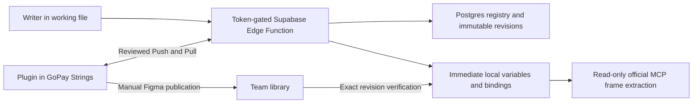

# String Binder: authoring, Supabase registry and library sync

Accepted implementation specification, 2026-10-06. Supabase is the authoritative saved registry. Working files and GoPay Strings are editable delivery surfaces that carry committed identity/revision metadata. Deployment is pending the team's Supabase project setup. Local fixtures support development without authentication; remote requests always validate credentials.

## Chosen defaults

- Supabase Free pilot in Singapore; no Google integration, Apps Script or user login.
- Embed only a limited team token in the internal writer build. Publisher setup uses a separate credential stored privately on the maintainer's device. Server/database credentials remain outside the plugin.
- Writers review and submit copy without a second approval gate. New strings bind locally immediately; central library publication happens separately.
- EN and ID are both required for creates and wording edits. Preserve exact whitespace, Unicode and line breaks; trimming only detects empty fields.
- Exact bilingual duplicates are suggestions. Explicit reuse retains identity; explicit distinct creation receives a new identity, even for identical wording.
- IDs and developer keys are immutable. Context and translations can change. Historical aliases, redirects, tombstones and migration history remain preserved.
- Working files refresh while their plugin is open. Library changes require reviewed Push/Pull. Closed files catch up on later plugin/library updates.
- One designated publisher initially. A renewable lease coordinates sessions, but does not make Figma edits transactional.

The embedded token is extractable and authorizes its holder. It does not prove writer identity. Device IDs and optional names are unverified attribution. Direct anonymous table/RPC access is denied. Publication and sync acknowledgement require the publisher credential. See [Supabase API key guidance](https://supabase.com/docs/guides/getting-started/api-keys).

## Writer journeys

### Open and apply existing copy

Open the plugin and choose **Apply existing copies** or **Create new copies**. Library sync is secondary. Read cached copy immediately and connect in the background. Switching modes preserves drafts.

Apply keeps existing product-plus-Shared search, ranking, selection, skips, includes, unbinds and flags. Select a frame, choose/search saved copy, and review selected changes and matching targets on the current page before Confirm Apply. Conflicting existing bindings are retained. Managed text layers are renamed to the frozen developer key.

A record can be applied before central publication. The controller resolves the selected registry revision, materializes local EN/ID delivery variables when needed, and binds those occurrences. A newer registry revision invalidates a stale reviewed selection instead of silently applying another wording.

### Create canvas copy

1. Write copy into a Figma frame and select the frame.
2. Choose Create new copies. Visible text appears in reading order; every row starts **Keep as is**. Hidden text is excluded. Non-copy candidates show a reason and remain available for explicit inclusion.
3. Choose individual rows or Select eligible unbound rows. Select a product. Set the frame's canvas language, with per-row EN/ID overrides. Canvas wording fills that language; enter the translation in the plugin. Both fields remain editable.
4. Correct inferred screen/context/role, inspect duplicate suggestions, and review the provisional key, bilingual pair, product collection and fixed occurrence targets. Concurrent creations may add a suffix to the final key.
5. Save and apply. Preflight source fingerprints/fonts; commit the reviewed registry batch; receive final IDs/keys/revisions; create/reuse local variables; bind approved occurrences; rename layers; show saved/apply results separately.
6. Move to the next frame. Drafts and unfinished operations survive mode changes, selection changes and reopen.

Keep rows receive no creation, rebinding, renaming or parent-language-mode change. If a kept occurrence already uses an intentionally edited shared identity, it follows that identity's updated value.

### Reuse, edit, variant and restore

- **Reuse existing:** compare product, context, key and both translations; select the saved identity. Do not automatically merge identical concurrent submissions.
- **Edit existing globally:** keep ID/key; edit both languages and context; review the global effect. Saving uses the reviewed expected revision. Current-file usages update in place or move from older published variables to newer local delivery variables. Other open plugins poll; closed files and the library catch up later. Do not claim a complete cross-file usage count.
- **Create variant:** new ID/key with `forkedFrom`; bind the selected frame and reviewed duplicates. Other usages retain the original identity. Duplicating a frame alone does not fork identities.
- **Manual local variable change:** automatic refresh protects it. Open the bound row to review an edit, create a variant, or explicitly restore saved values. Restoration warns that all known usages of the local variable are affected.

## Library journeys

Publisher setup stores the separate credential and registered library URL privately. File markers are routing checks, never authentication. GoPay Strings uses its supplied URL and verified existing local variable key; the controller does not depend on `figma.fileKey`, which requires private-plugin API access. See [Figma file-key API](https://developers.figma.com/docs/plugins/api/figma/#filekey).

### Check, Push and direct creation

Edit EN/ID variable values in GoPay Strings, then Library sync → Check changes → choose Use Figma / Push or Combine → Review → Confirm. The same validation, revision checks and transaction function used by writers saves the batch. Only afterward does Figma receive committed metadata. Existing variables update in place; IDs, developer keys and Figma variable keys remain stable.

For a genuinely new variable in a product collection, review both translations and context, choose distinct creation or explicit duplicate reuse, then Push. Attach the saved identity to that existing variable. Do not create another Figma variable for the same direct-library submission. Explicit reuse consolidates its occurrences onto the canonical variable; remove the temporary variable only after verified rebinding and no remaining references.

Resolve unidentified legacy variables by existing registry keys/aliases. Ambiguous ownership blocks reconciliation. Never mint a replacement identity or add new entries to `# Legacy` collections.

### Pull and conflict resolution

Pull missing/changed saved revisions into the correct product collection, resolve language modes by name, and preserve existing variable keys. Review a fixed manifest; edits arriving afterward stay pending. Protect unpushed Figma changes. Restoring a changed frozen key is an explicit Pull action.

Compare three versions: **B** = last synchronized record; **L** = actual local values/context; **R** = current saved registry record.

| Comparison                             | State / action                                                  |
| -------------------------------------- | --------------------------------------------------------------- |
| L = B and R = B                        | Up to date                                                      |
| L differs; R = B                       | Local changes; reviewed Push                                    |
| L = B; R differs                       | Remote changes; reviewed Pull                                   |
| L = R                                  | Adopt saved revision without a wording edit                     |
| L and R both differ and disagree       | Conflict                                                        |
| Missing trusted B                      | Explicit initial reconciliation                                 |
| Missing variable                       | Pull to recreate; keep registry identity and record new mapping |
| Identity/key mismatch or missing modes | Resolve error; do not infer a new identity                      |

For conflicts, show B/L/R and offer Use Supabase, Use Figma, Combine, or Defer. Use Figma/Combine saves against the currently reviewed R revision; a later remote change reopens the conflict. Defer does not modify the record. Adopt requires matching bilingual values; use Pull to explicitly replace local wording.

Push commits before Figma metadata stamping. Pull writes Figma before acknowledgement. Persist compressed fixed manifests, operation IDs, successes and outstanding work privately; retries rescan before creation. Recheck the publisher lease before each chunk and stop on lease loss. An old acknowledgement never clears a newer revision.

### Publish and migrate bindings

After reviewed Push/Pull, publish through Figma, then Verify publication. The controller checks all applied entries against their exact records, actual bilingual values, baseline revision and `CURRENT` publish status. Only then acknowledge the manifest's published revisions.

Working-file refresh migrates local bindings only when the registry mapping, published revision, imported identity and actual bilingual values agree with the needed revision. Older published wording cannot replace a newer local revision. Keep managed local variables until no bindings reference them. Protect manual edits and preserve each occurrence's locale; do not detach instances automatically.

## Recovery and statuses

| Case                                       | Behavior                                                                                 |
| ------------------------------------------ | ---------------------------------------------------------------------------------------- |
| Missing translation / invalid placeholders | Highlight validation; complete or Keep before submission                                 |
| Canvas changes after review                | Commit remains saved; changed occurrences remain unapplied for reconciliation            |
| Save succeeds, binding/font/metadata fails | Saved, with outstanding Figma work; retry using the saved response                       |
| Save response lost / times out             | Look up or resend the same request ID and payload/identities                             |
| Competing edits                            | First valid commit succeeds; second gets latest record/conflict, no partial batch writes |
| Concurrent same-stem creates               | Transactionally allocate distinct final keys with `_2`, `_3`, etc.                       |
| Backend/token/configuration unavailable    | Preserve drafts/cache; disable saves; existing available Figma bindings remain usable    |
| Variable renamed/deleted                   | Keep identity/key; explicit reconciliation restores name or recreates mapping            |
| Duplicate delivery mirrors                 | Reconcile same identity; never automatically fork                                        |
| Publisher interrupted or lease lost        | Resume fixed manifest from verified state; preserve partial successes                    |
| New edits during Pull/publication          | Leave newer revisions pending                                                            |
| Figma Undo                                 | Undo canvas only; saved registry records and reservations remain                         |

Each authoring row carries one working-file status: Draft, Saved not applied, Bound locally, Using published library, Update pending or Conflict (a manual variable edit). Each library row and the summary above the list carry Up to date, Local changes, Remote changes, Conflict or Needs publish; Needs publish means the synchronized revision has no verified publication yet. Results list the registry save and the Figma operation separately. Completion never implies publication or instant updates to closed files.

Reviewing a global edit or a restore counts the text layers bound to that identity across the current file and says that other files are not counted.

## Controller, registry and delivery contracts

Typed UI/controller operations carry correlation IDs. Network requests run in the native controller; polling/debounce/timers run in the UI. The generated manifest allows the configured Supabase project origin, validated by the sandbox check. A localhost registry is accepted only with `COPY_ALLOW_LOCAL_REGISTRY=1`, lands in `devAllowedDomains`, and fails the sandbox check in CI. The Edge Function reports only its own validation failures as definite rejections (422); database or network faults are 503 so clients keep the pending request for retry. Browser helpers remain excluded from native/domain/shared runtime code.

The 640 × 760 authoring/sync window has a scrolling body and persistent actions. Apply retains its compact layout. Shared selection, duplicate matching, fonts, language resolution, search and binding primitives are reused. New bindings/variants affect selected and reviewed page targets; global edits and refresh load current-file pages as needed and report inaccessible occurrences.

| Storage                                      | Responsibility                                                        |
| -------------------------------------------- | --------------------------------------------------------------------- |
| `copies`                                     | Current committed record; preserved legacy metadata                   |
| `key_reservations`                           | Globally unique frozen keys, historical aliases and tombstones        |
| `copy_revisions`                             | Immutable bilingual/context revisions                                 |
| `requests`                                   | Idempotent payload hash and saved result                              |
| `changes`, `registry_head`                   | Commit-ordered catalog/delivery changes                               |
| `products`                                   | One configured product/name/key-token/legacy-group list               |
| `libraries`, `library_mappings`, `sync_runs` | Destination registration, leases, exact manifests and acknowledgement |
| `migration_history`                          | Preserved original ledger and prepared merge events                   |

The Edge Function exposes catalog, ordered changes, batch submission, request status, immutable revision lookup, and publisher-only library start/ack/publication. Administrator bootstrap/backup/restore RPCs are absent from the team router. Tables and RPCs deny direct anonymous/authenticated access. Token hashes support overlap during rotation, and database counters enforce rate limits. Disabling the platform JWT check does not bypass custom token validation. [Edge Function authentication](https://supabase.com/docs/guides/functions/auth).

Every reviewed batch acquires the registry-head transaction lock, validates all expected revisions/idempotency/permissions, allocates permanent key reservations, writes copies/revisions/events/request response, and commits together. Create is create-only. A repeated request returns its saved result; a changed payload using that ID is rejected. Conflicting actions to one identity must agree. Context edits do not rekey. Keys use authoritative normalization/shortening and preserve role/qualifier when adding collision suffixes.

Full catalog reads use one consistent database snapshot and aggregate all rows, avoiding default row limits. Deltas return bounded ordered pages and advance the cursor only through returned events. Sequence allocation holds the lock through commit, preventing missed concurrent events. Search runs over cached data. Compress private catalogs/drafts/manifests; respect Figma's 5 MB per-plugin quota by evicting disposable caches before durable work, and refuse a submission if its recovery journal cannot be persisted. [Figma client storage](https://developers.figma.com/docs/plugins/api/figma-clientStorage/). Poll every 30 seconds with jitter/backoff; refresh before submission and after save. A poll rescans the working file (all pages) only when the registry sequence moved, after a delivery, or on a manual Refresh. Realtime subscriptions are outside v1.

Only used identities materialize in working files. Product collections have explicit management markers, EN/ID modes and `TEXT_CONTENT` scope. Unrelated existing names receive a `<Product> · String Binder` delivery collection; partition after 4,000 variables. Working delivery variables are hidden from publication. Use the existing `copy` shared-data namespace for identity, committed records and compatible occurrence snapshots; descriptions retain readable context/Note plus compact revision/fingerprint metadata. Incomplete or stale metadata cannot make an unverified frame ready for developer handoff.

## Developer handoff

Developers supply frame links to their official Figma MCP client and run the versioned read-only extractor. The bundle includes frame/node occurrences, immutable IDs, developer keys, applied revisions/locales, exact EN/ID records, unmanaged text and consistency issues. Local committed copy needs no central publication.

Resolve aliases by named locale. Verify actual values against metadata. Report unknown identities, unpushed wording, missing modes, stale fingerprints and conflicting revisions. Bounded chunks are assembled completely; changes during/between reads require restarting. Never fetch newer backend wording to substitute for the frame snapshot. Cross-file assembly must report identity/revision/value disagreements. See [developer instructions](developer-handoff.md).

## Build and rollout

Implementation modules cover typed contracts/domain rules, deterministic mock journeys, Postgres/Edge Function, writer save/materialization/recovery, working-file refresh, library Push/Pull/conflicts/publication and read-only extraction. [Deployment instructions](supabase-setup.md) cover secrets, bootstrap, rotation, external encrypted backups and empty-project restore testing.

Bootstrap preserves all existing identities, aliases, tombstones and migration redirects. The 62 historical keys claimed by more than one identity in the 20,602-record prepared registry are resolved by `pnpm registry:resolve-keys` into a reviewed file that bootstrap applies: a current key's holder owns it (53), otherwise the claimant the ledger shows once had it as its own key (3), otherwise the key is reserved with no identity listing it as an alias (6). Any conflict the file does not cover still blocks import. Figma mapping registration happens through reviewed initial library reconciliation; it is never guessed by bootstrap.

Validate unit/domain/native-controller/MCP tests, PGlite transaction tests and browser journeys, plus Node 22 typecheck/lint/build/sandbox checks. Local simulations do not replace deployed multi-connection concurrency testing or real Figma/MCP/publication acceptance. `pnpm test:staging` exercises ten concurrent creates and competing edits against a disposable configured registry seeded with at least 20,000 records.

Pilot acceptance: writer create/local binding, competing edit, variant/global update, direct library Push, remote Pull, interrupted recovery, verified publication and complete developer bundle. Measure storage/history, transfer/invocations, latency, conflicts, failures, sync lag and publication backlog. Use daily external encrypted backups and verify restoration. Check Free limits at rollout and upgrade when operational needs warrant it: [Supabase pricing](https://supabase.com/pricing).

Branches/releases, automatic publication, unattended updates to closed files, admin rekeying and destructive registry deletion are outside v1.
