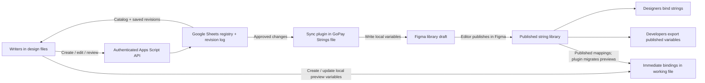

# String Binder: concurrent authoring and library delivery

Decision prepared on 2026-10-02; immediate-binding and Sheets-access constraints added on 2026-10-06. The team's Figma plan is recorded as non-Enterprise. This is the implementation plan for the later create/edit feature; no authoring service is deployed. Writers must be able to bind newly saved copy immediately in their working files, before library sync or publication. The user has a service account approved only for Google Sheet editing and wants to avoid requesting additional GCP access.

## Recommended source of truth

Use the hosted registry as the authoritative copy store. Figma's GoPay Strings file is its published delivery surface. All plugin clients write through one authenticated backend; they do not compete to edit library variables directly.

Use Google Sheets as the initial registry, with one Apps Script project providing authenticated reads and serialized writes, subject to confirming Workspace deployment policy and Figma connectivity. Apps Script can use an automatically managed default Cloud project, avoiding a new Cloud Run or Firestore deployment: [default Cloud projects](https://developers.google.com/apps-script/guides/cloud-platform-projects). This route executes as an authorized Google user and does not require the existing service-account key. Sheet editing permission for the service account does not itself authorize Apps Script deployment. If an existing approved server is already available, it can instead use that service account behind an authenticated API, but it must supply equivalent single-writer coordination. Keep search local over a versioned catalog using the ranking implemented here.

The user can request access to create Apps Script; availability of an existing server is unknown. Proceed with the Apps Script route as the planning assumption, with deployment/access and authenticated plugin connectivity still unverified. Prefer a maintainer-owned standalone script and keep its code/settings restricted to maintainers; ordinary writers use the plugin and do not need editor access to either the script or managed registry tabs.

The unavoidable boundary: Figma's Variables REST API requires Enterprise membership and appropriate seats/permissions. Even on Enterprise, writing variables does not publish them. With this team's plan, a plugin must run **inside the library file**, write its local variables, and an editor must publish the library in Figma. A server alone cannot provide unattended cross-file write-and-publish on this plan. See [Figma Variables API requirements](https://developers.figma.com/docs/rest-api/variables/) and [variable endpoints](https://developers.figma.com/docs/rest-api/variables-endpoints/). The documented API has local/published reads and local writes; the Plugin API exposes publishing status, not a publishing operation: [Variable API](https://developers.figma.com/docs/plugins/api/Variable/).

“Saved and bound locally” and “Available in library” are separate states. Immediate binding uses a local preview variable in the working file; it does not wait for publication. The sync plugin can stay open during a writing session to reduce delivery delay, but it cannot work while the library file/plugin is closed. A working-file plugin likewise cannot refresh local previews or migrate their bindings while closed. If fully unattended immediate publication is mandatory, Figma cannot be the sole delivery channel under the current plan; developers would also need a registry release endpoint. An Enterprise upgrade removes the open-library requirement for _writing_, while publishing still needs its own supported workflow.

## Records and concurrency

| Managed Sheet tab | Purpose |
| ----------------- | ------- |
| `Copies` | One row per immutable Copy ID: frozen platform key, locale values, context, usages, status, revision, actors, redirects and tombstone |
| `Keys` | Permanent reservation of every current key and historical alias, pointing to a Copy ID; never delete reservations |
| `Requests` | Actor/request ID, payload hash and saved response for safe retries; reject reuse with a different payload |
| `Changes` | Append-only audit revisions and delivery work items; also supports catalog deltas |
| `Libraries` | Allowed Figma files, publisher leases and checkpoints |
| `Mappings` | Library/Copy ID to Figma collection/variable ID and key, synced revision, published revision and previous mappings |
| `Meta` | Catalog sequence and schema version, committed with each mutation |

Every mutation goes through the same Apps Script project and `LockService.getScriptLock()`: acquire the lock, reread authoritative state, check request/revision/key reservations, then commit copy, key reservation, request response, change event and catalog sequence in one Sheets `spreadsheets.batchUpdate`. Release the lock in finally; return a retryable busy result on lock timeout. A batch applies its subrequests atomically, but does not make the preceding read conditional: the script lock and exclusive write path supply that missing coordination. See [Lock Service](https://developers.google.com/apps-script/reference/lock/) and [atomic Sheets batches](https://developers.google.com/workspace/sheets/api/guides/batch).

An uncertain commit outcome is not a failed save. Retain a durable in-flight mutation manifest and reconcile the request record and intended rows before retrying an append or admitting conflicting writes. If the outcome cannot be established, block mutations for maintainer recovery rather than risk duplicate creation or stale overwrites. This recovery path must be exercised in the implementation spike; a script lock alone is not a database transaction.

Managed tabs are protected from ordinary writer edits, structural changes and independent service-account jobs. Human edits and other scripts do not honor the Apps Script lock; approved manual maintenance must use the API or happen during a write pause. Use filter views instead of physically sorting storage rows. Optional exact-value lookup caches are derived, never authoritative; verify actual locale values under the lock. Do not rely on separate SpreadsheetApp writes for an atomic save.

Create uses a client-generated CSPRNG UUIDv7 Copy ID and a persistent request ID. IDs avoid collisions, but do **not** prevent lost edits or duplicate copy; serialized validation and the atomic commit do that. For two simultaneous identical creates, the second execution checks the first execution's committed values and reuses the entity with an added usage. For two simultaneous key collisions, reserve the next available `_2`, `_3` under the lock, honoring tombstones and aliases. Never invent a random replacement key after a failed save.

Edit sends `expectedRevision`. Under the lock, compare it to the current revision; a mismatch returns a structured revision conflict with both versions for review. Never silently overwrite the other writer. Increase the entity revision and write its immutable change record together. Client retries reuse the same request ID, including after an ambiguous timeout. Enforce writer/reviewer/publisher roles server-side; never put the service-account private key or an organization-wide write secret in the plugin. Per-writer revocable tokens provisioned by a maintainer are an initial authentication option if approved; store token verifiers server-side and derive the actor from the verified token, not an email in the request. Workspace sign-in is preferable if its plugin handoff can be verified without additional GCP access.

Exact reuse compares **every available locale**, including placeholder names, case, punctuation, whitespace and line breaks. Missing translations remain draft and cannot accidentally merge with an approved bilingual string. Numeric/data-only values and whole placeholders remain contextual. A shared-copy edit affects all usages: show that impact, require review, and offer “Create a variant” to fork an ID for a product-specific change. Shared identity does not mean translations are interchangeable.

## Deterministic creation rules

The runnable helpers live in `packages/domain/src/copy-identity.ts`, exported from `@string-binder/domain`. `createCopyId(timestamp, entropy)` uses the migration's UUIDv7/Crockford format. The caller must obtain ten CSPRNG bytes using Web Crypto in the UI or `node:crypto` on the server. `isCopyId` checks the encoding, UUID version and variant. Do not use `Math.random`, text hashes, timestamps alone, counters or Figma node IDs as identity.

“Deterministic” means one creation operation always retains the same identity and one normalized context proposes the same developer key. It does not mean independently creating the same wording generates the same ID. Exact-copy reuse belongs in the serialized registry service, preserving the existing canonical ID.

1. Generate and persist the proposed Copy ID and request ID once before sending. Keep them across network retries and UI restarts. Same actor/request ID + same canonical payload returns the saved response. Reusing a request ID for different content returns a structured conflict.
2. Normalize product, feature, screen and context with `copyKeyStem`; role and optional primary/secondary/tertiary qualifier are explicit. Example: Split bill / Pay & split / Confirm / CTA primary → `gopay_splitbill_payandsplit_confirm_cta_primary`. Key normalization excludes locale and wording. Reject unsupported roles or an overlong key for correction.
3. Under the script lock, read the request, existing exact values, proposed ID and candidate key reservations **before any writes**. An exact approved match returns its canonical ID. An existing proposed ID owned by a different creation operation returns a structured conflict; never update that entity, treat it as reuse, or silently regenerate identity.
4. `nextCopyKey` proposes the bare key, then the smallest available ordinal from `_2`. Supply all current keys, aliases and tombstones reread under the lock. Enforce create-only semantics in the API and include copy, usages, permanent key reservation, request response and audit work item in the same atomic batch. Every retry must reacquire the lock and recheck the request before computing mutations. A client-side free-key check alone provides no concurrency guarantee.
5. Return the committed canonical ID/key to the plugin. Freeze both on all later wording and context edits. A fork is a fresh operation with `forkedFrom`; deletion retains permanent reservations. Never let an edit endpoint accept changes to identity/key, and reject stale `expectedRevision`.

The helper test covers repeatable UUID encoding, invalid IDs, normalization, alias/tombstone reservations and ordinal collisions. The service must additionally test concurrent executions, lock timeout and restart/retry recovery when implemented; these helpers do not constitute a deployed concurrent allocator.

## API and writer flow

The table names logical operations. For Apps Script, implement them through doGet/doPost action dispatch, not an assumed PATCH-capable REST router. Return structured JSON success/error envelopes, including conflict and busy codes, rather than relying on custom HTTP error statuses. First prove an authenticated request from the real Figma plugin, response redirects and domain allowlisting, and a successful read/write round trip. Apps Script deployment permissions and browser/network behavior must be verified before calling this a no-new-access deployment. See [web apps](https://developers.google.com/apps-script/guides/web) and [Content Service redirects](https://developers.google.com/apps-script/guides/content).

| Operation                               | Contract                                                                                                                                      |
| --------------------------------------- | --------------------------------------------------------------------------------------------------------------------------------------------- |
| `GET /catalog?stream=transfer`          | Only that stream and shared copies; include aliases, usages, record revisions, publication state and redirects                                |
| `POST /copies`                          | Request ID, proposed Copy ID, product/usage, inferred role and localized values; response is created or reused plus canonical ID/key/revision |
| `PATCH /copies/:id`                     | Request ID + expected revision + edited fields; immutable identity/key cannot be changed                                                      |
| `POST /copies/:id/approve`              | Reviewer checks translations, placeholders and shared impact; enqueues approved revision for library delivery                                 |
| `POST /libraries/:id/lease`             | Publisher-only, short renewable lease; one sync session for this library                                                                      |
| `GET /libraries/:id/pending`            | Approved revisions and mappings, plus unresolved failures                                                                                     |
| `POST /libraries/:id/ack`               | Lease token + exact applied revisions + returned Figma IDs/keys; mark synced, never automatically published                                   |
| `POST /libraries/:id/confirm-published` | Publisher confirms the specific revision manifest after publishing and verifying status; mark released revisions                              |

Select a frame → infer product, role and context → show existing matches → select unbound text to create → confirm copies and translations → save to the registry → immediately create/reuse a local preview variable and bind the layer. The plugin handles IDs and keys. A missing locale is shown as a translation task, not filled with the other language; immediate binding requires a value for the selected locale. A new string gets “Bound locally · waiting for library sync”, then “Bound locally · waiting for publish”, then “Using published library”. Binding to the actual team variable is enabled only after it has a published key. The UI distinguishes a local preview from a published team variable.

The catalog should deliver a complete initial snapshot and immutable revision changes with a stable cursor. Apply updates by Copy ID and revision, including redirects/tombstones; capture a change cursor **before** building the snapshot, then replay changes so concurrent updates are not lost. Overlap pages and deduplicate change IDs when equal timestamps cross page boundaries. Publish a fresh catalog after delivery so the current per-user cache does not keep old copy indefinitely.

## Immediate bindings and working-file sync

1. Keep the registry authoritative. A local preview is a delivery copy, identified by the existing immutable Copy ID, not a separate entity. Store the Copy ID, last applied revision and preview marker on the local variable; retain the published mapping separately. Layer names remain the frozen developer key, and managed layers also carry the Copy ID. Never identify an entity solely by its current text or layer name.
2. Create previews in a dedicated plugin-managed collection, hidden from library publication. Resolve EN/ID modes by name and preserve the selected layer/frame locale when binding or migrating. Materialize only copy used in this file, not the entire catalog. The plugin already supports reading and binding local variables; extend that path rather than creating a second binding engine.
3. Save to the backend first, then materialize the committed canonical ID/key/revision in Figma. A network retry reuses the request ID; a Figma failure after a successful save offers retry-binding without recreating the entity. Reuse one local preview per Copy ID in a file. Concurrent plugin sessions in the same Figma file can still race because Figma writes have no database transaction: rescan before creation, detect duplicate previews and reconcile their bindings. Do not claim that a backend lease makes Figma writes atomic.
4. Editing existing copy uses PATCH with expectedRevision. To preview the committed edit immediately, create/reuse its local preview and switch occurrences bound to its known published variable in the current file to that preview. Scan all pages when applying a file-wide replacement; preserve unrelated bindings and report instances or layers that cannot be changed. The same Copy ID/key remains. Offer an explicit fork for a change intended only for this screen.
5. Refresh used-copy revisions on plugin open, before binding, after a save and periodically while open. A simple API poll is sufficient for the first version. Update a local preview's value in place, so its bound occurrences update together. Compare the last applied snapshot with local Figma values before overwriting; manual local edits require reconciliation through the registry. Other files with active plugins refresh on their next poll; closed plugins refresh when run again.
6. When a published mapping is available, import the real library variable and migrate preview-bound occurrences in this file. Migrate only when the confirmed published revision covers the preview revision and the imported values/modes match that release. Never replace revision 8 preview copy with revision 7 published copy. Make rebinding resumable and retain previews while any bindings remain; remove only verified unused managed previews. Failed or inaccessible occurrences remain visibly pending.
7. Existing library-bound occurrences in other files receive released changes through Figma's normal library-update workflow. Local-preview occurrences require working-file plugin sync. Thus all occurrences converge, but neither a database save nor a plugin running in one file guarantees instant updates across every closed file. Search must distinguish latest saved copy from published values and refresh changed revisions, not just discover new variable keys.

For the initial backend, use one authenticated Apps Script API and the managed Sheet tabs, with revision records doubling as pending delivery work. No separate queue broker, search service or real-time collaboration engine is required. Cache the catalog for plugin search and transfer deltas; save explicit actions rather than every keystroke. Batch edits and use backoff/jitter for polling. Benchmark at the existing roughly 20k-copy catalog and expected simultaneous writer count before rollout; Sheets API and Apps Script quotas are deployment limits, not a guarantee of database-like throughput. See [Sheets quotas](https://developers.google.com/workspace/sheets/api/limits) and [Apps Script quotas](https://developers.google.com/apps-script/guides/services/quotas).

## Library sync

1. Verify the exact allowed library file and a publisher lease. In the library, match variables using `copy/id` plugin data, then description line 1. Backfill legacy IDs from the registry. Ambiguous/missing identity is a failure to review, not permission to mint a replacement.
2. Resolve `EN` and `ID` by name. Create missing approved entities in product collections or Shared; keep a 4,000-variable operational limit and split numbered partitions. Figma currently documents a 5,000-variable API limit, so 4,000 is headroom, not its physical limit.
3. Update existing variables in place, preserving Figma keys. For each applied revision store the Copy ID, revision and operation ID on the variable as well as its description. Upsert by ID and rescan before creation on recovery; a crash before acknowledgement must not create a second variable. Resolve aliases by locale, not first mode.
4. Write and acknowledge a fixed revision manifest. Edits arriving during sync stay queued for the next pass. An acknowledgement for revision 4 cannot clear revision 5. Renew the lease during the pass. If it is lost, stop writes; on takeover rescan and reconcile. Figma edits are not a distributed transaction with the registry, so the backend must not describe the lease as an absolute fence against a stale plugin client. A sole designated publisher is the simplest operational starting point.
5. Show failures and “Publish these changes in Figma”. After the editor publishes, use variable publish statuses and the saved manifest for confirmation. Only then acknowledge those revisions as published. Crash recovery repeats reconciliation and acknowledgement safely.
6. Designers accept library updates and reload the Binder catalog. Developers fetch the **published library file**, not arbitrary design-file copies or pending backend drafts. On a non-Enterprise plan, use a plugin exporter in the library file for the released revision manifest and EN/ID bundles; Variables REST export is also Enterprise-gated. Retain immutable export snapshots matching each published manifest, including legacy-key redirects. The exporter must refuse pending draft revisions or export the saved last-published snapshot; dumping current local variable values while unpublished edits exist would expose the wrong release.

Do not let direct library edits become an untracked second source of truth. The sync screen compares Figma values and stored revisions before writing; a manual discrepancy blocks that entity and offers import-as-registry-edit with normal revision review. A library-file rename or move changes mappings, not Copy IDs or developer keys.

## Rollout

The search fixes work against the current library. `pnpm prepare:library` generates the replacement package and exact merge map without editing the original migration ledger. The package preserves all 20,602 IDs, archives 3,508 exact duplicates through redirects, and emits 12,885 active variables; 847 are in Shared.

For a clean import, duplicate GoPay Strings first, import the per-product packs and both modes, backfill IDs, verify values and mappings, then publish. Existing design bindings still reference the old Figma keys: use the merge map and old Copy IDs to migrate bindings before retiring any original variables. Reimporting JSON alone does not repair existing bindings. Alternatively, keep the original variables as compatibility aliases to canonical shared variables while files transition. The search now collapses exact copies without needing this migration immediately.

Build create/edit after verifying Apps Script deployment/authentication/connectivity, registry Sheet access, library file allowlist and publisher ownership. Implementation order: authenticated serialized registry → catalog/deltas → writer create/edit with immediate local previews → working-file revision refresh → library sync/recovery → publication confirmation and preview migration → published export. Test two same-key creates, two identical-copy creates, competing edits, lock timeout, ambiguous save timeout, save-success/bind-failure recovery, same-file duplicate previews, a lost publish acknowledgement, a publisher crash during create, editing a newer revision during sync, locale preservation and interrupted migration. Do not deploy an empty backend or install another search service before these flows are implemented. A later move to a transactional database retains Copy IDs, revisions and API contracts; Cloud Run/Firestore is a future capacity option, not an initial access requirement.
